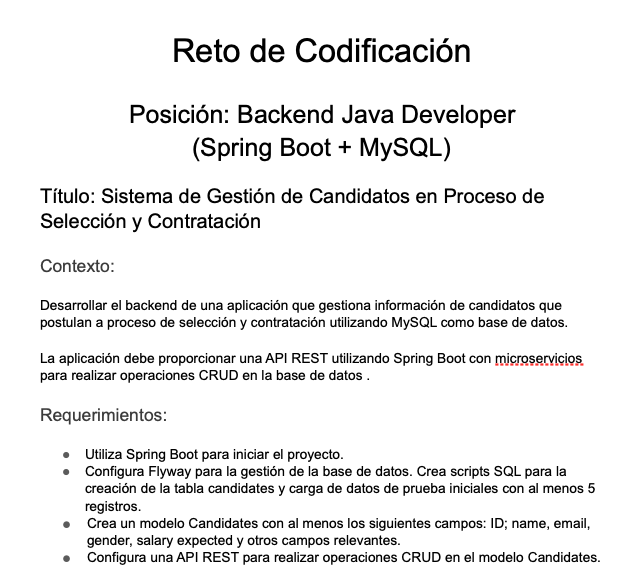
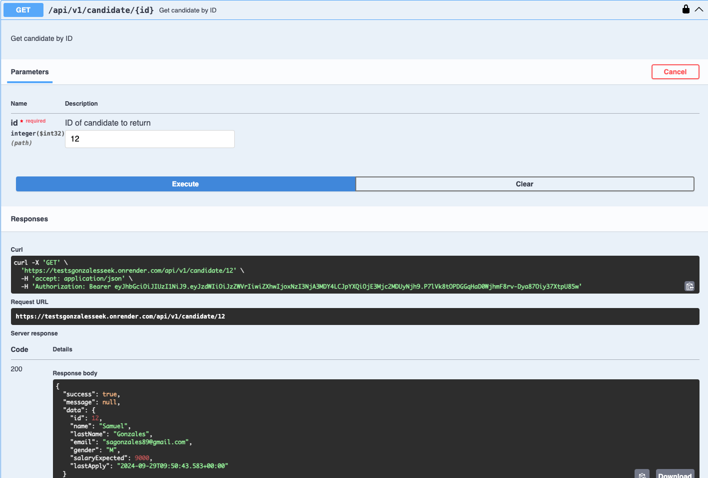
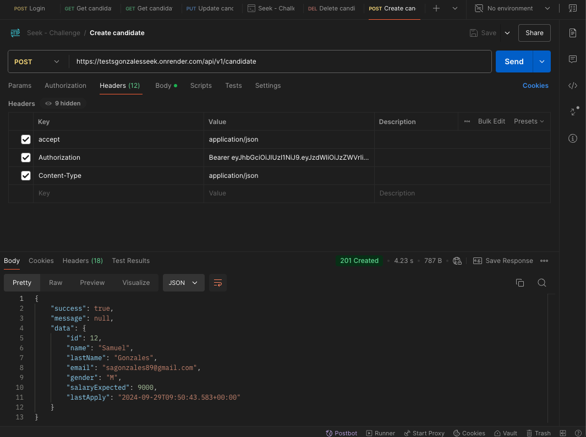
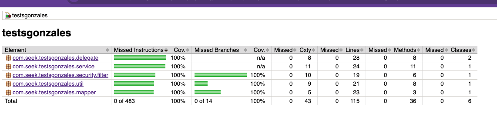

# My implementation for the [Seek](https://seekglobal.co/) challenge 💪

### Index

- [Description](#description)

- [Features](#features)

- [Todo](#todo)

- [Technologies & Tools](#-technologies--tools)

- [Run on local](#run-on-local)

- [Test evidences](#test-evidences)

- [Authors](#authors)

---------------------------------------------------------------------------------------------------------------------------------------------------------------------------------

## Description

<p>
Develop a RESTful API that allows you to manage candidates for a job position.


</p>

## Features

✅ `Feature 1:` CRUD Candidates

✅ `Feature 2:` JWT Authentication and validation

✅ `Feature 3:` Login

✅ `Feature 4:` Pipeline to run unit and integration test and also deploy to [Render](https://render.com/)

## Todo

☑️ `Feature 1:` AWS installation pipeline

---------------------------------------------------------------------------------------------------------------------------------------------------------------------------------

## 🛠 Technologies & Tools

- **Language:** Java 21
- **Framework :** Spring Boot 3
- **Architecture :** Layered Architecture
- **Web framework :** Spring REST
- **Data framework :** Spring Data JPA
- **Database :** PostgreSQL
- **Api Docs :** Spring Doc
- **Container :** Docker and Docker compose
- **Unit test :** Spock Framework
- **Integration test :** Spock Framework


---------------------------------------------------------------------------------------------------------------------------------------------------------------------------------

## Run on local

For local development, first set:

On Unix based systems:

```shell
export ACTIVE_PROFILE=local
```

On Windows:

```shell
set ACTIVE_PROFILE=local
```

This will ensure that the local development configurations are applied.

Then, from the command line:

```
    ./gradlew clean build
    ./gradlew bootRun
```

> NOTE: If you are on windows, replace `./gradlew` for `gradlew.bat`.

### Local development docker-compose

Inside `docker/` folder, there's a `docker-compose.yml` file that describes the
resources required to run this application. By default, it gets run during application
initialization.

If you run into any issues or just don't want to use this feature,
go to `resources/application-local.properties` and set `spring.docker.compose.enabled`
to `false`. Then you will need to handle running `docker-compose up`
before starting the application.

Before starting the application, take a look at docker-compose file and
ensure that you don't have any other container using the ports that
this application requires.

Also, make sure that your docker daemon is running before starting the
application.

### Swagger UI
After starting the application, you can access the Swagger UI by going to
`http://localhost:8080/swagger-ui.html`.

## Testing

This repository includes both Unit tests under folder `test` and integration tests under
`integration-test`.

```
    ./gradlew test # unit tests
    ./gradlew jacocoTestReport # test coverage report
    ./gradlew integrationTest # integration tests
    ./gradlew jacocoIntegrationTestReport # integration test coverage report
    ./gradlew jacocoTestCoverageVerification # validates coverage or throws an error
```

## Test evidences





-------------------------------------------------------------------------------------------------------------------------------------------------------------------------

## Authors

| [<br><sub>Samuel Gonzales</sub>](https://github.com/samusfree) |  
|:---------------------------------------------------------------------------------------------------------------------------------------:|
